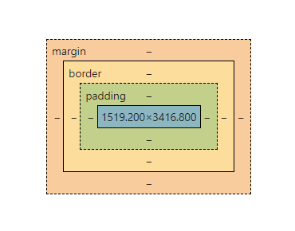

# coding_Everybody

HTML, CSS, JS 기본기를 다시 다지기위해 생활코딩을 정주행하며 만들어본 예제들이다.

### 태그

옷에 달린 tag처럼 text를 어떻게 나타낼지 설명한다.

`<strong>` : bold체
`<h1>` ~ `<h6>` : 제목

### 줄바꿈

`<br>` : 한 줄이 떨어진다. 여러 번 사용 가능하다.
`<p>` : 문단이 나눠진다. 정해진만큼의 여백만 벌어지기에 시각적 자유도가 떨어진다.

웹은 접근성이 중요하며, 신체적 결함이 있는분들도 정보들로부터 소외되지 않도록 노력해야한다.

### 속성

``태그 내의 src 부분을 속성(Attribute)이라고 한다. 이 속성은 위치는 상관없고 태그만으로 정보가 부족할 때 사용한다.

### 목차

`<li>` : list의 약자로 목차용 태그로 사용한다.
`<ul>` : Unordered List의 약자로 `<li>`태그의 부모로 리스트의 구분을 줄 수 있다.
`<ol>` : Ordered List의 약자로 자동으로 숫자가 넘버링 된다.

### 문서의 구조

`<title>` : 이 태그를 사용하면 본문의 제목을 변경할 수 있다.

컴퓨터는 0101 이진법만 처리하기 때문에 한글을 바로 사용하면 깨짐 현상이 일어나기에 UTF-8로 열릴 수 있도록 `<meta charset="utf-8">`를 작성해주어야 한다.
char은 문자 set은 규칙을 뜻한다.

이 코드들은 `<head>`태그로 묶이며 본문을 설명해준다.

본문은 `<body>` 태그로 묶인다.

이 두가지를 `<html>` 테그로 묶는다. 이 위에 관용적으로 `<!doctype html>`로 표시한다.

### 링크

`<a>` : anchor의 약자로 링크 태그이다. 이 태그로 인해 다른 사이트들이 고립되지않고 공유될 수 있다. 사이트끼리 연결하는 본드나 실의 역할

```HTML
<a href="", target="_blank" title="html"  > : 링크 넣는 장소, 새 탭 열기, 마우스 올리면 설명 나오기 (툴팁)
```

### 웹의 역사

1960년 인터넷의 탄생하였고, 1990년에 Web이 등장하였다.

###### 웹의 메소포타미아

info.cern.ch

### 서버와 클라이언트

Web Browser(client컴퓨터)에서 Web Server(server컴퓨터)로 요청(request)을 보내면 Web Server에서 index.html을 찾아서 응답(response)한다.

### 웹호스팅

Web server를 연결하기 위한 컴퓨터를 Host라고 한다. 웹서버를 제공해주는 회사를 웹호스팅 업체라고 한다.

GitHub에서도 무료로 호스팅이 가능하다.

Settings -> GitHub Pages -> Source(none -> 해당branch) -> Save

각 컴퓨터의 웹서버 주소
http://127.0.0.1/ <= **I**nternet **P**rotocol **Address**

http(Hyper Text Transfer Protocol)는 Web Browser과 Web Server과 통신할 때 사용하는 통신규약이다.

## CSS

### 기본 문법

1. `<style>` 태그를 사용하여 css 효과를 줄 수 있다.

```CSS
<style>
    a{
        color:red;
    }
</style>
```

2. style 속성을 사용하여 css 효과를 줄 수 있다.

### class

class 속성을 주면 특정 값에 css 효과를 줄 수 있다. class 선택자는 '.'이다.

여러 개의 클래스의 영향을 받는 경우 가까이 있는 명령이 더 큰 영향이 있기 때문에 class는 그다지 좋은 방법은 아니다.

### id

그래서 사용하는 것이 'id'이다. id 선택자는 '#'이다. 그러면 순서와 관계없이 속성을 적용시킬 수 있다.

##### 강한 순서

태그 선택자 < class 선택자 < id 선택자

그 이유는 id선택자의 값은 web에서 한 번만 등장할 수 있다. (중복되서는 안된다.) 유일무이하다.
좀 더 구체적인 것이 포괄적인 것보다 우선순위가 높다.

### box model

틀을 잡기 위해서는 box model이라는 개념이 중요하다.

`<h1>`태그는 줄바꿈이 자동으로 되나 `<a>` 태그는 줄바꿈이 되지않고 다른 콘텐츠들과 같은 라인에 위치한다.

이유는 링크는 자기 크기만큼 사용하고 `<h1>`태그는 화면 전체를 사용하는 태그이기 때문이다.

테두리를 넣어주면 부피감을 알 수 있다.

여기서 화면전체를 사용하는 태그를 'block level element'라고 한다.

자기 자신의 크기만큼 사용하는 태그를 'inline element'라고 한다.

display를 사용하여 서로 속성을 변경할 수 있다.

```CSS
display : block;
display : inline;
```

padding : 컨텐츠와 테두리의 간격
margin : 테두리 사이의 간격
width : 너비



개발자 도구에 들어가면 content, padding, border, margin을 볼 수 있다.

### Grid

`<div>`태그는 아무 의미없이 디자인의 용도로 사용하는 태그이다. 기본적으로 block element이기에 줄 전체를 사용한다.
`<span>`태그도 마찬가지로 디자인의 용도인지만 inline element이다.

```CSS
display:grid;
grid-template-columns : 150px 1fr;
```

[caniuse](caniuse.com)에 들어가면 사용빈도수를 알 수 있다.

### 반응형 디자인

화면의 크기에 따라 웹페이지의 각 요소들이 반응해서 동작하는 것

`@media` 미디어쿼리

먼저 화면의 크기를 알아보기위해 개발자도구에서 화면의 크기부터 측정을 해야한다.

```CSS
@media(min-width : 800px){
    display :none;
}
/*스크린의 폭이 800px보다 크다면 화면을 안보이게*/
```

여러가지화면이 존재하는 세상에서 굉장히 중요한 쿼리이다.

### CSS코드의 재사용성

`<style>`태그를 통한 CSS 속성을주면 다른 페이지에 적용시킬 때 복잡하고 시간이 오래걸린다.
모든 페이지에 중복 적용시키기 때문에 수정시에도 오래걸린다.

중복의 제거를 하려면 따로 CSS파일을 만들어서 `<link>`태그를 사용하면된다.

```Html
<link rel="stylesheet" href="style.css">
```

코드가 줄어 경제적 효과도 볼 수 있다.

네트워크적인 측면에서는 내장 CSS를 넣는 것이 트래픽이 덜 발생한다. 하지만 **캐싱**이라는 기능으로 CSS파일이 변경되기 전까지
우리의 컴퓨터에 저장해놨다가 CSS파일을 요청하면 저장된 결과를 가져와 속도를 높일 수 있고 사용로도 절약할 수 있다.

중복을 제거하여 가독성과 재사용성을 높이고 유지보수를 편리하게 하는 것이 굉장히 중요하다.

## Javascript

Javascript는 사용자와 상호작용을 하는 언어이다.
이러한 특성이 Web Page를 제어하여 훨씬 dynamic하게 만들어준다.

또한, HTML위에서 동작한다.

개발자도구에 **console**를 이용하면 파일을 만들지 않아도 js를 즉각 실행시킬 수 있다.

우리가 js를 이용한다는 것은 거대한 웹페이지를 만들 수도 있지만, 이미 만들어진 페이지에서의 문제도 해결할 수 있다.

### script태그

`<script>`태그는 JS의 사용을 알린다.

Javascript와 html의 차이가 무엇이냐 생각할 수 있지만, 1+1로 비교해봤을 때 html은 1+1이 출력되고 js는 동적이기에 2가 출력된다.

##### 글씨 출력 시 사용하는 문법

```javascript
document.write("출력내용");
```

### 이벤트

```Html
<input type="button" value="내용" onclick="이벤트함수" />
```

웹브라우저 위에서 일어나는 사건을 `event`라고 한다.

웹브라우저에서 일어날 수 있는 이벤트

1. `onclick` : 버튼 클릭을 감지하는 이벤트
2. `onchange` : 입력된 텍스트가 변경됨을 감지하는 이벤트
3. `onkeydown` : key가 다운되는 것을 감지하는 이벤트
   ...
   이벤트를 이용하여 사용자와 상호작용하는 웹페이지, 웹사이트를 만들 수 있다.

### console

1. `.length` : 문장의 길이를 측정
2. `.toUpperCase()` : 소문자를 대문자로 변경
3. `.indexOf()` : 파라미터안에 입력한 문자의 시작위치를 알려줌

문자열이냐 숫자냐에 따라 결과가 달라지기에 데이터 타입을 정확하게 표현해야한다.

### 변수와 대입연산자

변수는 변경될 수 있는 값이다.

'='는 대입연산자라고 한다. 오른쪽 값을 왼쪽 값에 대입

상수는 변하지 않는 값이다.

variable vs constant

```javascript
var name = han;
```

### 제어할 태그 선택

```Javascript
document.querySelector('속성, 아이디, 클래스').style
```

### 프로그래밍, 프로그램, 프로그래머

'HTML'과 'Javascript'는 둘 다 컴퓨터언어이다. 동시에 'JavaScript'는 프로그래밍언어이다. 단, 'HTML'은 프로그래밍언어가 아니다.

**프로그램**의 중심에는 순서라는 의미가 자리잡혀있다. 이 순서를 만드는 것을 **프로그래밍**이라고 하고 이 **프로그래밍**을 만드는 사람을 **프로그래머**라고 한다.

'HTML'은 웹페이지를 묘사하는 목적의 언어이기에 시간의 순서에 따라 실행되지는 않는다.
'JS'는 사용자와 상호작용하기 위해 고안되었고 그를 위해 시간의 순서에 따라 구현되기에 'HTML'과는 차이가 있다.

### 조건문

조건에 따라 다른 순서의 기능들이 실행되는 것

if 뒤에는 boolean 타입이 들어오고 선택에 따라 if와 else가 실행된다.

```javascript
if(true){

}else{

}

if(false)){

}else{

}
```

### 비교 연산자와 불리언

=== 좌항과 우항의 관계에 따라 true와 false를 만들어내는 연산자.

boolean = true, false

불리언 데이터타입을 사용하여 단순 반복에서 해방될 수 있다.

이항연산자는 좌항과 우항을 결합하여 값을 만든다.

`&lt;`, `&gt;` less than, greater than

### 리펙토링

코드 자체를 효율적으로 만들어 유지보수를 높이고 가독성을 높이도록 개선하는 것을 말한다.

`this`와 변수를 사용하여 중복을 없앨 수 있다.
